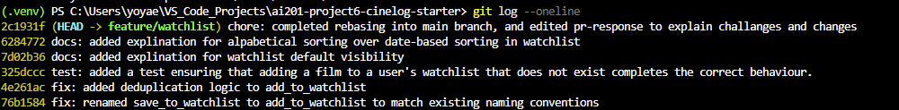

# PR Response Doc — CineLog Watchlist Feature

## AI Usage
One way I used AI in this project was helping me through the rebasing process as I have never done it before, and was running into issues. I used it to help me through the process so that I can correctly achievemy desired result.

## Comment 1 — Rename
**What I did:**
I renamed `save_to_watchlist` to `add_to_watchlist` and changed all instances of it in the code to the new function name.

**How I verified:**
I verified that all instances of `save_to_watchlist` were changed by using my editor's search all file feature. Using this tool, I found all instances of `save_to_watchlist` in my code and changed them to the correct name.

## Comment 2 — Deduplication
**What I did:**
I added Deduplication logic to my `add_to_watchlist` function in the same way `add_to_collection` in `collection_service` does. 

**How I verified:**
I verified the Deduplication logic by running a test when I add the same film twice into the watchlist. This resulted in the second addition of the film throwing the correct error, hence I verified my deduplication logic.

## Comment 3 — Missing test
**What I did:**
I created the test_watchlist python file in the tests folder. To this file I added a test that makes sure that adding a nonexistent film to a user's watchlist completes the correct behaviour.

**How I verified:**
I verified that this worked properly by running the test, and ensuring that it worked as intended, and that my test passed.

## Comment 4 — Default visibility
**My position:**
A user's watchlist should be public.

**Reasoning:**
A watchlist has two primary uses for most people, to keep track of what the person wants/is planning to watch, and to be able to share this information with others, so that they see what they are generally interested in, and to reccomend movies to the person. So a watchlist automatically being public makes sense, as it is then sharable to other users, so the above purposes can be reached, and movie reccomendations can be made without recommensing movies to the user without only recommending movies that the user has already watched. So the watchlists being automatically public allows for this behaviour, and overall makes sharing movies with others easier, and less repetative.

**Tradeoff acknowledged:**
A possible tradeoff of this stand is that users do not want anyone to know what they want to watch, as this can be deeply personal information, which they do not wish to share publically for people to see. However, the watchlist being public is only a default, and not a requirement, so a person that feels this way can set their own watchlist to private. The watchlist being public is something that I believe is more relevent to more people, so hence it is defaulted to public.

## Comment 5 — Sort order
**My position:**
Alphabetical sorting for watchlist should remain.

**Reasoning:**
Alphabetical sorting of watchlists allows for much quicker navigation of movies for the user, as it is much easier to check wheter you already have a movie on your watchlist, rater than beginning to search through the whole list of movies. Additionally as mentioned above, this is also useful for others engaging with the user's watchlist to check if a movie recommendation they have is already on the list, hence reducing obsolete suggestions, and allowing the app to be more easily sociable.

**Engagement with reviewer's point:**
While I understand your reasoning for wanting the watchlist to be ordered by date, as most people want to see what they added recently, I somewhat disagree with this stance. If a person adds something to their watchlist, it most likely means that they want to watch it regardless of when it was added. Addtionally, I find that the idea of sorting the watchlist by date would actually be detremental to the idea of the watchlist, as in most cases, if the watchlist was sorted by date, only the last few movies would be visible to the user, thus any older movies added to the watchlist will be pushed down and forgotten about, meaning that the list will build, and older movies a person wants to watch, will most likely not be watched. Alphabetical sorting solves this issue, as it is much easier to think and execute "today I'll watch a movie starting with 'L'" and jumping to the letter L in the list, rather than "today I'll watch a movie I added to my watchlist 3 years ago."

## Comment 6 — Rebase
**What conflicted:**
The main conflicts were `models.py`, and `.gitignore`.

**How I resolved it:**
I resolved the `.gitignore` issue by adding `.pytest_cache/` to it, as it was present in main, but not my branch, so I added it to the git ignore list. The secondary, and main, issue with the rebase was the fact that the new `models.py` did not include the `WatchlistEntry` class. I solved this by adding it back into `models.py`. This however, did not solve all of the issues, as in the branch I rebased onto had different logic for the movie ID. I changed `WatchlistEntry` to work with this difference. The only remaining difference was changing the comments in `watchlist_service.py` and `watchlist.py` as they refered to the movie id as integers, instead of the strings they now were. No other changes were necessary, as the logic and code didn't need to change in any way to accomidate the change from integer to string.

**How I verified no conflict remains:**
I verified that no conflicts remained by both checking my new commit log, and most importantly, running the pytest tests again to ensure everything still works correctly.

## Commit History

## PR Description

**What it does:**

This PR creates a watchlist for each user. Watchlist is a list that stores movies that the user intends on watching in the future. It adds two features:

- `GET/watchlist/<user_id>` - returns the watchlist as a list.
- `POST/watchlist/<user_id>\add` - adds a movie to the user's watchlist.

**Design Decision:**

There were two design decisions made in this project
- Setting watchlists to be public by default.
- Ordering watchlists alphabetically.

**How to Test:**

1. Start the app: `python app.py` (Runs on `http://127.0.0.1:5000`)

2. Add seed data for a test user and test movies.

3. Add created movie to the user's watchlist.

4. Check user's watchlist to ensure it was added.

5. Add same movie to the watchlist again to test that deduplicity works properly

6. Add a nonexistent movie to the watchlist to ensure that non-existent movie logic works correctly

7. You can also run `pytest tests/ -v` to ensure all existing tests, and adding non existent movie to watchlist work properly.